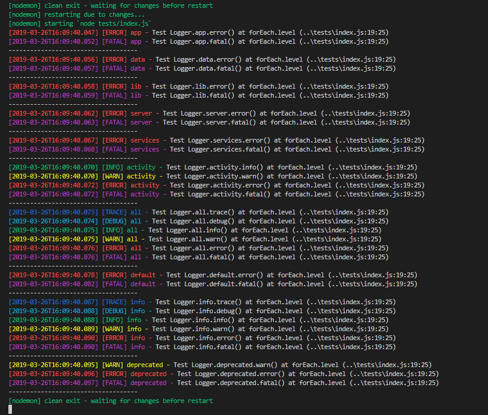

# XtrmAddons Soft Suite Logger API [](README.md)


## Logger

```js
const Logger = require("xtrmaddons-soft-suite-logger");
```

## Enregistreurs de catégories

| Categories | File | Level | Uses |
|:----------:|:-----|:-----:| ---- |
|`activity`| logs/*environment*.activity.log| `info` | catégorie application activité |
|`all`| logs/*environment*.debug.log| `trace` | toujours réaliser un log à n'importe quel niveau dans n'importe quel environnement. |
|`app`| logs/*environment*.debug.log| `trace\|error` | catégorie pour les fichiers d'application |
|`data`| logs/*environment*.debug.log| `trace\|error` | catégorie pour SQL & Données |
|`default`| logs/*environment*.debug.log| `error` | journal par défaut uniquement pour stdout |
|`deprecated`| logs/*environment*.deprecated.log| `warn` | catégorie obsolète class & function |
|`info`| logs/*environment*.activity.log| `trace` | catégorie application informations |
|`lib`| logs/*environment*.debug.log| `trace\|error` | catégorie application bibliothèque |
|`server`| logs/*environment*.debug.log| `trace\|error` | catégorie application serveur |
|`services`| logs/*environment*.debug.log| `trace\|error` | catégorie application services & extensions |

Enregistreurs de catégories:

```js
console.log(Logger.catKeys);

// Output
[
  'app',
  'data',
  'lib',
  'server',
  'services',
  'activity',
  'all',
  'default',
  'info',
  'deprecated'
]
```

## Exemples

```js
// Import Logger
const Logger = require("xtrmaddons-soft-suite-logger");

// exemple: log application événement fatal
Logger.app.fatal("L'application peut s'arrêter ici !");

// exemple: log application server activité
Logger.activity.info("Requête envoyée avec succès !");

// exemple: log application données
Logger.data.trace(myData);
```

## Exemples avec tests en image


