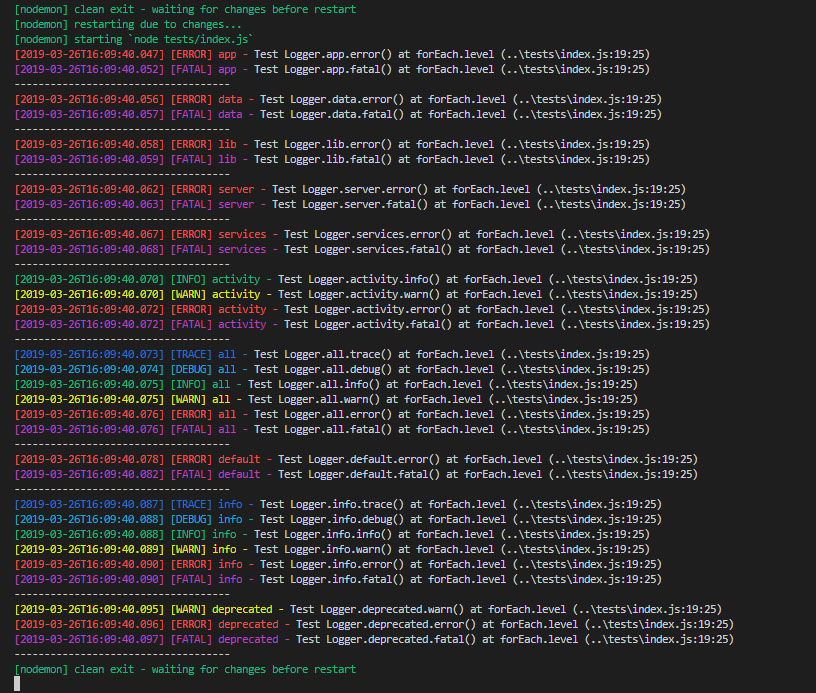

# XtrmAddons Soft Suite Logger API [](README.fr-FR.md)

## Logger

```js
const Logger = require("xtrmaddons-soft-suite-logger");
```

## Logger categories appenders

| Categories | File | Level | Uses |
|:----------:|:-----|:-----:| ---- |
|`activity`| logs/*environment*.activity.log| `info` | category application activity |
|`all`| logs/*environment*.debug.log| `trace` | to always log at any level in any environment. |
|`app`| logs/*environment*.debug.log| `trace\|error` | category for application files |
|`data`| logs/*environment*.debug.log| `trace\|error` | category for SQL & Data |
|`default`| logs/*environment*.debug.log| `error` | default log only to stdout |
|`deprecated`| logs/*environment*.deprecated.log| `warn` | category deprecated class & function |
|`info`| logs/*environment*.activity.log| `trace` | category application informations |
|`lib`| logs/*environment*.debug.log| `trace\|error` | category application library |
|`server`| logs/*environment*.debug.log| `trace\|error` | category application server |
|`services`| logs/*environment*.debug.log| `trace\|error` | category application services & extensions |

Logger categories appenders:

```js
console.log(Logger.catKeys);

// Output
[
  'app',
  'data',
  'lib',
  'server',
  'services',
  'activity',
  'all',
  'default',
  'info',
  'deprecated'
]
```

## Examples

```js
// Import Logger
const Logger = require("xtrmaddons-soft-suite-logger");

// example: log application fatal event
Logger.app.fatal("The application can crash here !");

// example: log application server activity
Logger.activity.info("Request send successful !");

// example: log application data
Logger.data.trace(myData);
```

## Examples with tests in image

